<div align="center">

#  Memory Match Madness

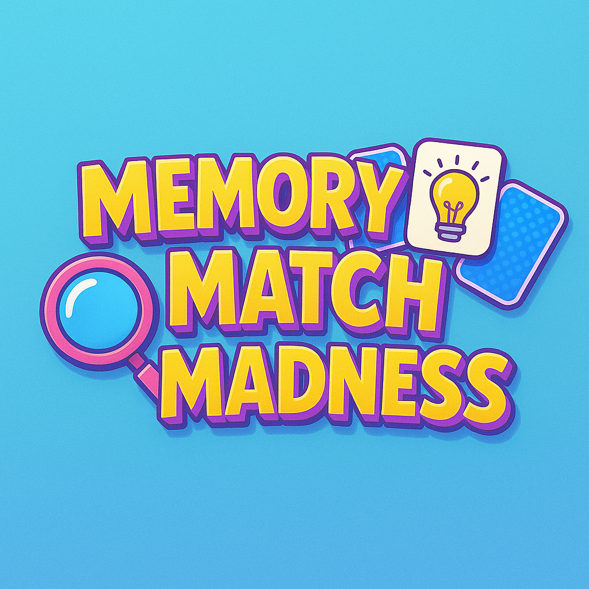

### *A vibrant cognitive training game that reimagines the classic memory card match experience*

---

<!-- BADGES -->
<p align="center">
  
  
  
  
</p>

<p align="center">
  
  
  
  
  
</p>

---

### 📹 Demo Video

<a href="https://youtube.com/your-video-link" target="_blank">
  
</a>

*📺 Click above to watch the full feature demonstration video*

</div>

---

## 📑 Table of Contents

<details>
<summary>Click to expand</summary>

- [👥 Team Details](#-team-details)
- [🎯 App Overview](#-app-overview)
- [✨ Key Features](#-key-features)
- [🚀 Innovative Implementations](#-innovative-implementations)
- [📸 Screenshots](#-screenshots)
- [🛠️ Tech Stack](#️-tech-stack)
- [🏗️ Architecture](#️-architecture)
- [⚡ Getting Started](#-getting-started)
- [🔄 GitHub Actions & CI/CD](#-github-actions--cicd)
- [🌐 API Documentation](#-api-documentation)
- [🎨 Design Considerations](#-design-considerations)
- [🗺️ Roadmap](#️-roadmap)
- [🙏 Acknowledgments](#-acknowledgments)

</details>

---

## 👥 Team Details

<div align="center">

| 👤 Role | 📛 Name | 🆔 Student Number | 📧 Email |
|:---:|:---:|:---:|:---:|
| **Developer** | Alyssia Sookdeo | ST10266994 | ST10266994@vcconnect.edu.za |
| **Developer** | Arshad Bhula | ST10343093 | ST10343093@vcconnect.edu.za |
| **Developer** | Cameron Chetty | ST10251749 | ST10251749@vcconnect.edu.za |
| **Developer** | Jordan Gardiner | ST10304100 | ST10304100@vcconnect.edu.za |
| **Developer** | Theshara Narain | ST10252746 | ST10252746@vcconnect.edu.za |

**🎓 Course:** BCAD Year 3  
**📚 Module:** Programming 3D (PROG7314)  
**📝 Assessment:** Portfolio of Evidence (POE) Part 2  
**🏫 Institution:** The Independent Institute of Education (Pty) Ltd  
**📅 Academic Year:** 2025

</div>

---

## 🎯 App Overview

<div align="center">

> **Memory Match Madness** is a comprehensive cognitive training mobile application that transforms the traditional memory matching game into an engaging, structured brain-training experience.

</div>

### 💡 Vision

Our app combines **entertainment** with **measurable cognitive improvement** through:

-  **Structured progression systems** for skill development
-  **Diverse themed content** for educational engagement  
-  **Social multiplayer features** for competitive motivation
-  **Offline-first architecture** ensuring uninterrupted gameplay

### 🎯 Target Audience

-  **Children** - Educational learning through themed cards
-  **Adults** - Brain training and cognitive improvement
-  **Seniors** - Memory maintenance and mental exercise
-  **Educators** - Classroom learning tool
-  **Therapists** - Cognitive therapy support

<div align="center">


</div>

---

## ✨ Key Features

### 🔐 Authentication & Security

<table>
<tr>
<td width="50%">

#### 🔑 Firebase Google SSO
Seamless single sign-on authentication with Google accounts

#### 👆 Biometric Login
Fingerprint authentication for secure, convenient access

</td>
<td width="50%">

#### 📴 Offline Auto-Login
Cached credentials for offline authentication

#### 🔒 Session Management
Secure user session handling with Firebase Auth

</td>
</tr>
</table>

---

### 🎮 Game Modes

<div align="center">

| 🌟 Arcade Mode | 🏆 Adventure Mode | 👥 Multiplayer Mode |
|:---:|:---:|:---:|
| Casual randomized gameplay | Structured 16-level progression | Competitive local play |
| Flexible endless sessions | Progressive difficulty scaling | Red vs Blue split-screen |
| No pressure advancement | Achievement milestones | Turn-based matching |

</div>

#### 🌟 Arcade Mode Features
-  Randomized level configurations
-  Varied grid sizes (3×2 to 6×4)
-  Session-based metrics tracking
-  Perfect for quick mental exercise

#### 🏆 Adventure Mode Features
-  16 unique challenging levels
-  Detailed performance metrics
-  Progressive difficulty scaling
-  Systematic skill development

#### 👥 Multiplayer Mode Features
-  Real-time score tracking
-  Shared card grid for fair play
-  Local competitive gaming
-  Family-friendly fun

---

### 🎨 Themed Content Library

<div align="center">

<table>
<tr>
<td align="center" width="20%">
  <br/>
  Wildlife & Pets
</td>
<td align="center" width="20%">
  <br/>
  Fresh Produce
</td>
<td align="center" width="20%">
  <br/>
  Popular Characters
</td>
<td align="center" width="20%">
  <br/>
  Racing Teams
</td>
<td align="center" width="20%">
  <br/>
  Magical Universe
</td>
</tr>
</table>

*Each theme provides unique educational value and visual appeal*

</div>


---

### ⚙️ Settings & Personalization

<div align="center">

<table>
<tr>
<td align="center">
  <h4>👤 Profile Management</h4>
  Custom display pictures<br/>and usernames
</td>
<td align="center">
  <h4>👆 Biometric Toggle</h4>
  Enable/disable<br/>fingerprint auth
</td>
<td align="center">
  <h4>🔔 Notifications</h4>
  <h6> (Coming Soon)</h6>
  Customize alert<br/>frequency & types
</td>
</tr>
<tr>
<td align="center">
  <h4>🎴 Card Backgrounds</h4>
  Multiple card<br/>back designs
</td>
<td align="center">
  <h4>🌐 Multi-Language </h4>
 <h6> (Coming Soon)</h6>
  Interface language<br/>support
</td>
<td align="center">
  <h4>♿ Accessibility</h4>
  High contrast mode<br/>scalable sizes
</td>
</tr>
</table>

</div>

---


</div>

#### 🔄 Smart Synchronization

- ✅ **Room Database** - Local data persistence for all game modes
- ✅ **Background Sync** - Automatic cloud synchronization on reconnection
- ✅ **Conflict Resolution** - Intelligent merging of offline and online data
- ✅ **WorkManager** - Scheduled background sync tasks
- ✅ **Auto-Detection** - Automatic online/offline mode switching

---

## 🚀 Innovative Implementations

<div align="center">

### 💎 Four Core Innovations That Set Us Apart

</div>

---

### 1️⃣ Dynamic Difficulty Adaptation System

<div align="center">

```
🎯 Player Performance → 🧮 Algorithm Analysis → ⚙️ Auto-Adjustment → 📈 Optimal Challenge
```

</div>

Automatically adjusts game parameters based on player performance:

- 📏 **Grid size modifications** (3×2 → 6×4)
- ⏱️ **Time limit adjustments**
- 🎚️ **Complexity scaling**
- 📊 **Personalized difficulty curves**
- 🎮 **Prevents frustration and boredom**

---

### 2️⃣ Multi-Categorical Educational Content

<div align="center">

> Transforms simple matching into **themed learning experiences**

</div>

#### 🎓 Educational Benefits

| Feature | Benefit |
|:---|:---|
| 📚 Cross-curricular learning | Supports multiple subjects |
| 👶 Age-appropriate content | Suitable for all ages |
| 🌍 Cultural awareness | Global perspective |
| 🧠 Memory training | Familiar icons boost recall |

---

### 3️⃣ Enhanced Social Multiplayer Integration

<div align="center">
  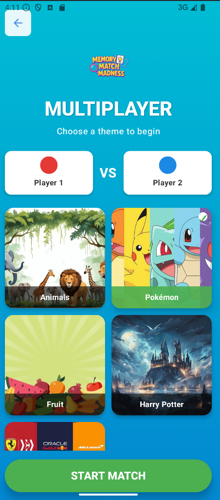<br/>
  <b>⏳ *Real-time competitive gameplay with score tracking*</b><br/>

</div>

#### 👥 Social Features

- ✅ **Local multiplayer** support
- ✅ **Leaderboard** systems
- ✅ **Replay** functionality
- ✅ **Community** engagement features
- ✅ **Family-friendly** competition

---


### 4️⃣ Dual Game Mode Framework

<div align="center">

<table>
<tr>
<th>🏆 Adventure Mode</th>
<th>🌟 Arcade Mode</th>
</tr>
<tr>
<td>

- 📋 Planned progression
- 🎯 Structured challenges
- 📊 Performance tracking
- 🏅 Achievement rewards

</td>
<td>

- 🎲 Spontaneous sessions
- 🔄 Random configurations
- ⚡ Quick play
- 🎮 Casual fun

</td>
</tr>
</table>

</div>

**Benefits:**
- ⏰ Accommodates different time commitments
- 🎯 Supports various user goals
- 🔄 Reduces routine fatigue
- 🎮 Flexible gaming experience

---

## 📸 Screenshots

<div align="center">

### 📱 Application Interface Gallery

</div>

#### 🔐 Authentication Flow

<table align="center">
<tr>
<td align="center">
  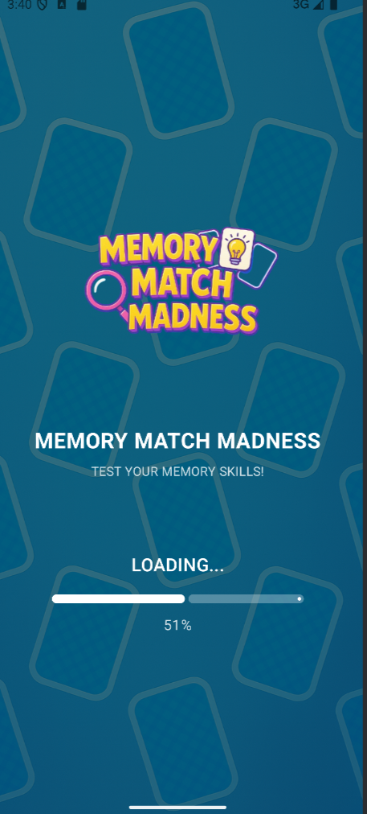<br/>
  <b>⏳ Loading Screen</b><br/>
  <sub>Initial app splash</sub>
</td>
<td align="center">
  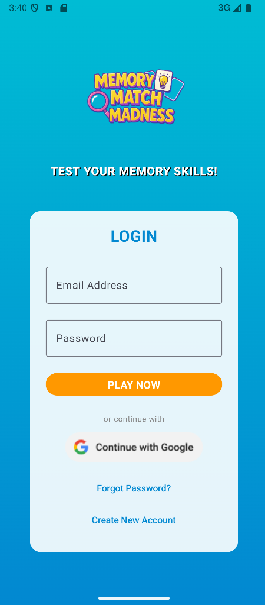<br/>
  <b>🔑 Login Screen</b><br/>
  <sub>Secure authentication</sub>
</td>
<td align="center">
  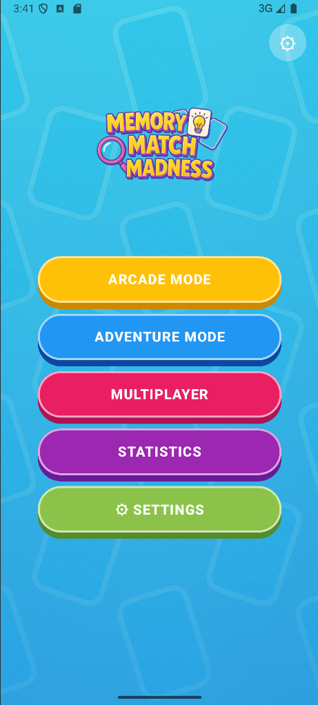<br/>
  <b>🏠 Main Menu</b><br/>
  <sub>Central navigation hub</sub>
</td>
</tr>
</table>

#### 🎮 Game Setup

<table align="center">
<tr>
<td align="center">
  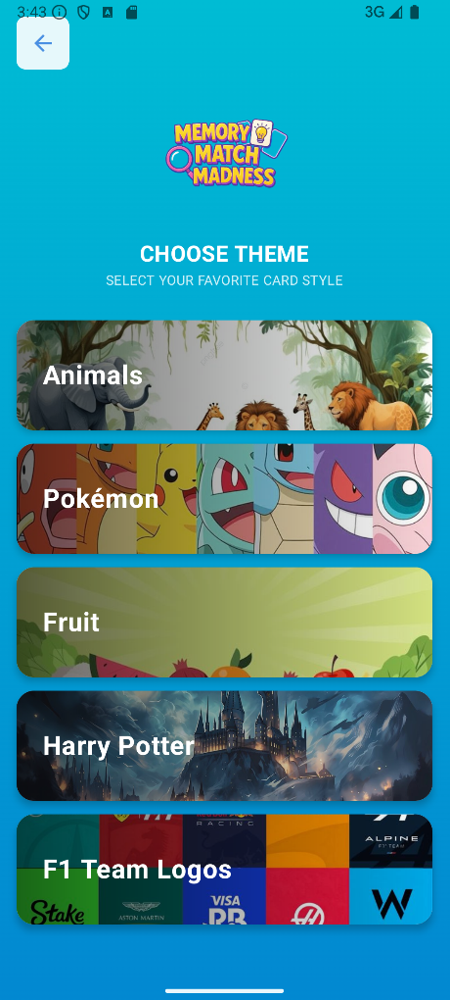<br/>
  <b>🎨 Theme Selection</b><br/>
  <sub>Choose card theme</sub>
</td>
<td align="center">
  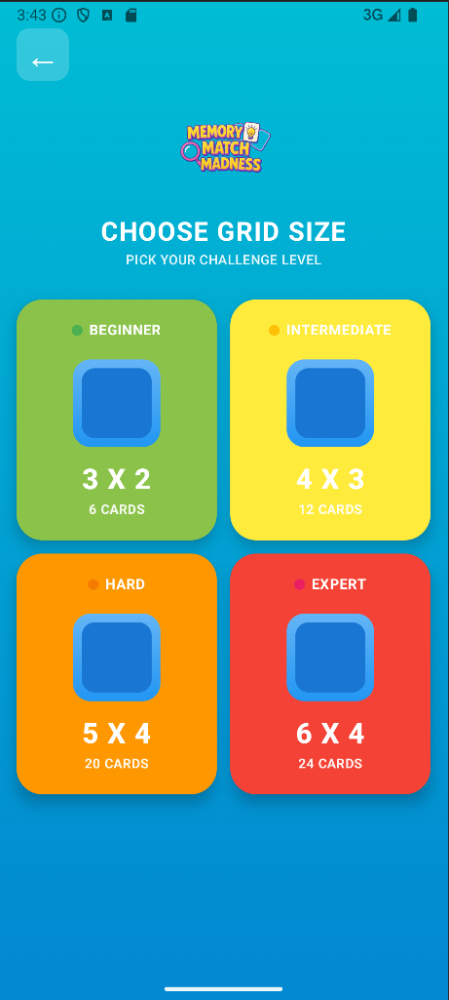<br/>
  <b>📏 Grid Size Selection</b><br/>
  <sub>Customize difficulty</sub>
</td>
<td align="center">
  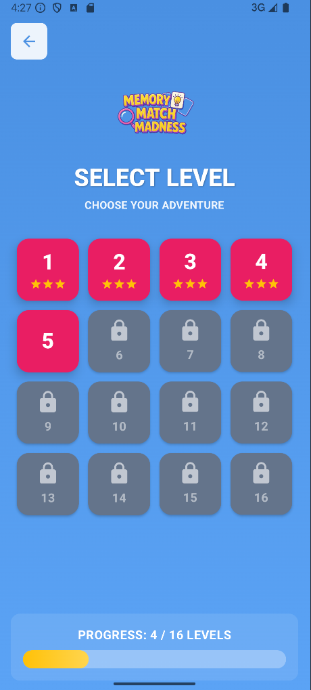<br/>
  <b>🏆 Level Selection</b><br/>
  <sub>Progressive challenges</sub>
</td>
</tr>
</table>

#### 🎯 Gameplay Experience

<table align="center">
<tr>
<td align="center">
  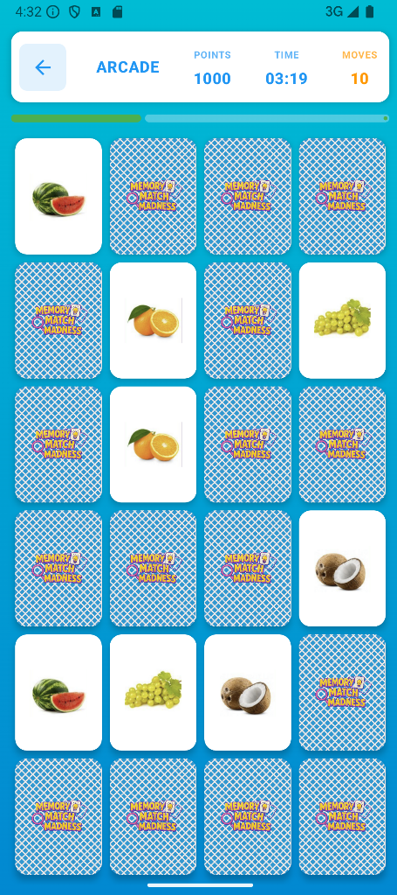<br/>
  <b>🎮 Active Gameplay</b><br/>
  <sub>Card matching session</sub>
</td>
<td align="center">
  <br/>
  <b>🎉 Completion</b><br/>
  <sub>Victory celebration</sub>
</td>
<td align="center">
  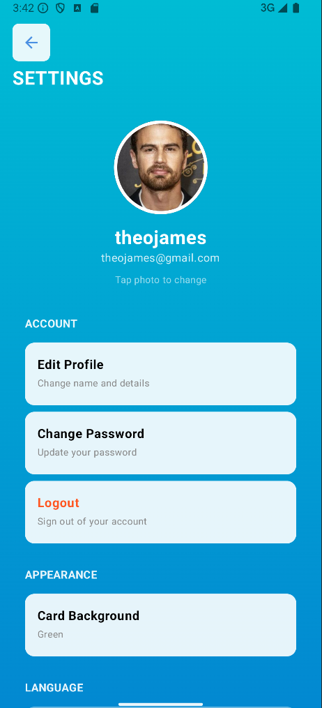<br/>
  <b>⚙️ Settings</b><br/>
  <sub>Profile management</sub>
</td>
</tr>
</table>

---

## 🛠️ Tech Stack

<div align="center">

### 📱 Frontend Technologies

<p>
  
  
  
  
</p>

### ☁️ Backend & Database

<p>
  
  
  
  
  
</p>

### 🔧 Development Tools

<p>
  
  
  
  
</p>

### 🔌 Key Libraries

<p>
  
  
  
  
</p>

</div>

### 📦 Dependencies Overview

<details>
<summary><b>Click to view detailed dependencies</b></summary>

```kotlin
// 🎨 UI & Design
implementation("androidx.compose.material3:material3:1.3.1")
implementation("androidx.navigation:navigation-compose:2.8.4")
implementation("io.coil-kt:coil-compose:2.4.0")

// 🔥 Firebase Suite
implementation(platform("com.google.firebase:firebase-bom:33.6.0"))
implementation("com.google.firebase:firebase-auth-ktx")
implementation("com.google.firebase:firebase-firestore-ktx")

// 👆 Biometric Authentication
implementation("androidx.biometric:biometric:1.2.0-alpha05")

// 🌐 Network Communication
implementation("com.squareup.retrofit2:retrofit:2.9.0")
implementation("com.squareup.okhttp3:okhttp:4.11.0")

// 💾 Local Database
implementation("androidx.room:room-runtime:2.6.1")
implementation("androidx.room:room-ktx:2.6.1")

// 🔄 Background Processing
implementation("androidx.work:work-runtime-ktx:2.9.0")

// 🧪 Testing
testImplementation("junit:junit:4.13.2")
androidTestImplementation("androidx.test.espresso:espresso-core:3.5.1")
```

</details>

---

## 🏗️ Architecture

<div align="center">

### 🎯 Four-Layer System Architecture

```
┌─────────────────────────────────────────────────────────┐
│                   📱 CLIENT LAYER                        │
│  ┌──────────┐  ┌──────────┐  ┌──────────┐  ┌─────────┐ │
│  │   Game   │  │   Auth   │  │  Room    │  │  Sync   │ │
│  │  Engine  │  │ Manager  │  │  DB      │  │ Manager │ │
│  └──────────┘  └──────────┘  └──────────┘  └─────────┘ │
└─────────────────────────────────────────────────────────┘
                          ↕️ HTTPS
┌─────────────────────────────────────────────────────────┐
│                  🌐 API LAYER (REST)                     │
│  ┌──────────┐  ┌──────────┐  ┌──────────┐  ┌─────────┐ │
│  │  /auth   │  │  /games  │  │  /themes │  │ /achieve│ │
│  │          │  │          │  │          │  │  ments  │ │
│  └──────────┘  └──────────┘  └──────────┘  └─────────┘ │
└─────────────────────────────────────────────────────────┘
                          ↕️
┌─────────────────────────────────────────────────────────┐
│               ☁️ WEB SERVER LAYER                        │
│  ┌──────────┐  ┌──────────┐  ┌──────────┐  ┌─────────┐ │
│  │ Firebase │  │ Firebase │  │   Cloud  │  │Firebase │ │
│  │Functions │  │ Hosting  │  │Messaging │  │  Auth   │ │
│  └──────────┘  └──────────┘  └──────────┘  └─────────┘ │
└─────────────────────────────────────────────────────────┘
                          ↕️
┌─────────────────────────────────────────────────────────┐
│                 💾 DATABASE LAYER                        │
│  ┌──────────┐  ┌──────────┐  ┌──────────┐  ┌─────────┐ │
│  │Firestore │  │ Firebase │  │ Firebase │  │ Content │ │
│  │ Database │  │ Storage  │  │Analytics │  │ Manager │ │
│  └──────────┘  └──────────┘  └──────────┘  └─────────┘ │
└─────────────────────────────────────────────────────────┘
```

</div>

### 🔍 Layer Details

<details>
<summary><b>📱 1. Client Layer (Android App)</b></summary>

- 🎮 **Local Game Engine** - Card matching logic and game state
- 🔐 **Authentication Manager** - Google SSO and biometric login
- 💾 **Local Storage (RoomDB)** - Offline game results and user data
- 🔄 **Sync Manager** - Cloud synchronization coordination
- ⚙️ **Settings Controller** - User preference management

</details>

<details>
<summary><b>🌐 2. RESTful API Layer</b></summary>

**Authentication Endpoints:**
- `POST /api/auth/login` - User authentication
- `POST /api/auth/register` - New user registration
- `POST /api/auth/verify` - Token verification

**Game Endpoints:**
- `POST /api/games/level-result` - Level completion data
- `POST /api/games/arcade-result` - Arcade session data
- `POST /api/multiplayer/result` - Multiplayer results

**Content Endpoints:**
- `GET /api/themes` - Card theme downloads

</details>

<details>
<summary><b>☁️ 3. Web Server Layer</b></summary>

- 🔧 **Firebase Functions** - Serverless API endpoint processing
- 🌍 **Firebase Hosting** - Static content delivery via CDN
- 📨 **Cloud Messaging** - Push notification dispatch
- 🔐 **Firebase Authentication** - User identity verification

</details>

<details>
<summary><b>💾 4. Database Layer</b></summary>

- 📊 **Firestore Database** - User profiles, game statistics, leaderboards
- 📁 **Firebase Storage** - Themed card images and content assets
- 📈 **Firebase Analytics** - Usage tracking and performance monitoring
- 🎨 **Content Management** - Theme updates and asset versioning

</details>

---

## ⚡ Getting Started

<div align="center">

### 🚀 Quick Start Guide

</div>

### 📋 Prerequisites

<table>
<tr>
<td>

**Required Software**
-  Android Studio Hedgehog | 2023.1.1+
-  JDK 11 or higher
-  Android SDK (API 32+)
-  Gradle 8.0+
-  Git

</td>
<td>

**Accounts Needed**
- 🔑 Firebase Account
- 📧 Google Account
- 🐙 GitHub Account

</td>
</tr>
</table>

---

### 📥 Installation Steps

#### **Step 1: Clone the Repository**

```bash
git clone https://github.com/VCDN-2025/prog7314-poe-part-2-st10251759.git
cd memory-match-madness
```

#### **Step 2: Open in Android Studio**

1. Launch Android Studio
2. Select `File` → `Open`
3. Navigate to cloned directory
4. Wait for Gradle sync to complete

#### **Step 3: Configure Firebase**

<details>
<summary>Click for detailed Firebase setup</summary>

1. Visit [Firebase Console](https://console.firebase.google.com)
2. Create a new project or select existing
3. Add Android app with package: `vcmsa.projects.prog7314`
4. Download `google-services.json`
5. Place file in `app/` directory
6. Enable Authentication, Firestore, and Cloud Messaging

</details>

#### **Step 4: Set up API Backend**

```bash
cd memory-match-maddness-api
npm install
```

Create `.env` file:
```env
PORT=3000
NODE_ENV=development
FIREBASE_PROJECT_ID=your-project-id
```

#### **Step 5: Update API URL**

In `RetrofitClient.kt`:
```kotlin
private const val BASE_URL = "https://memory-match-maddness-api.onrender.com"
```

#### **Step 6: Build & Run**

```bash
./gradlew build
```

Then click ▶️ **Run** in Android Studio!

---

### 🧪 Running Tests

```bash
# 🔬 Unit tests
./gradlew testDebugUnitTest

# 📱 Instrumented tests
./gradlew connectedAndroidTest

# 📊 Coverage report
./gradlew createDebugCoverageReport
```

---

## 🔄 GitHub Actions & CI/CD

<div align="center">

### 🤖 Automated Testing & Deployment Pipeline

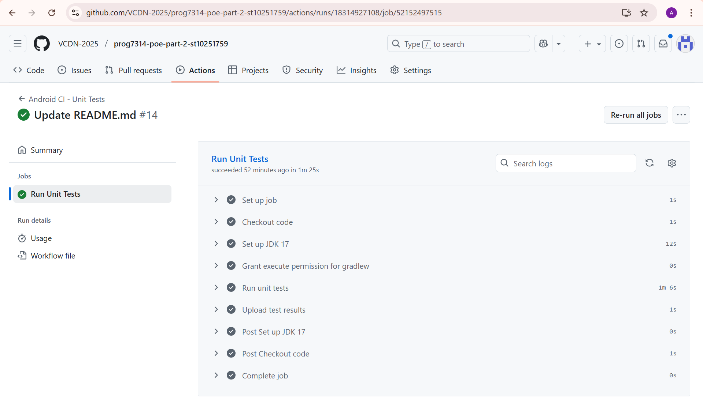
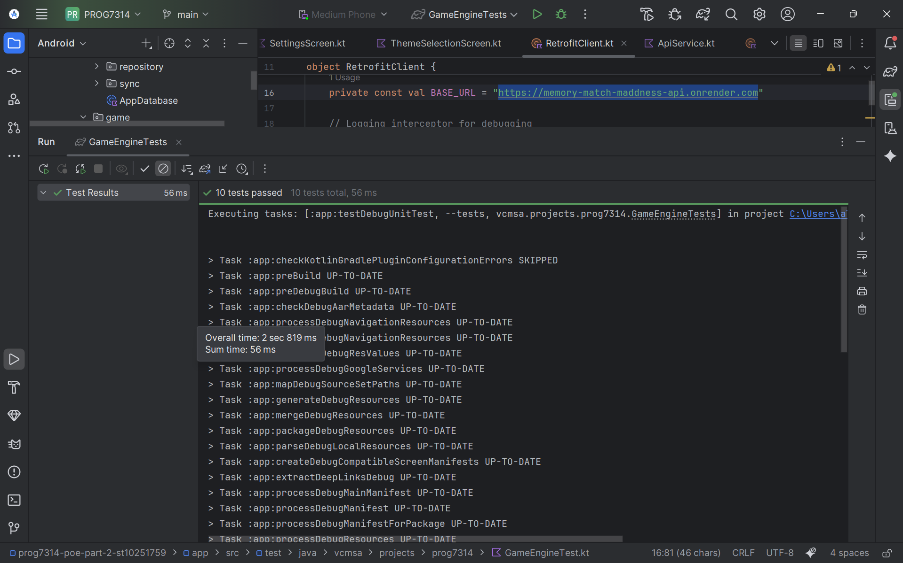


</div>

### ⚙️ Workflow Configuration

```yaml
name: Android CI - Unit Tests

on:
  push:
    branches: [ "main" ]
  pull_request:
    branches: [ "main" ]
  workflow_dispatch:

jobs:
  test:
    name: 🧪 Run Unit Tests
    runs-on: ubuntu-latest
    
    steps:
      - name: 📥 Checkout code
        uses: actions/checkout@v4
      
      - name: ☕ Set up JDK 17
        uses: actions/setup-java@v4
        with:
          distribution: 'temurin'
          java-version: '17'
          cache: 'gradle'
      
      - name: 🔧 Grant execute permission
        run: chmod +x ./gradlew
      
      - name: 🚀 Run unit tests
        run: ./gradlew testDebugUnitTest --stacktrace
      
      - name: 📊 Upload test results
        if: always()
        uses: actions/upload-artifact@v4
        with:
          name: test-results
          path: app/build/reports/tests/testDebugUnitTest/
```

### ✅ CI/CD Benefits

<div align="center">

| Feature | Benefit |
|:---|:---|
| ✅ **Automated Testing** | Every commit is automatically tested |
| 🏗️ **Build Verification** | Ensures code compiles in clean environment |
| 🐛 **Early Bug Detection** | Catches issues before merging |
| 📊 **Test Reports** | Downloadable test result artifacts |
| 🌐 **Cross-Platform** | Tests run on Ubuntu runners |

</div>

### 📈 Test Coverage

<div align="center">

```
 Total Test Cases: 15+
 Test Coverage: 70%+
 Critical Path: 100%
```

</div>

**Coverage Areas:**
- 🎮 Game Engine Logic
- 👥 Multiplayer Systems
- 💾 Database Operations
- 🔐 Authentication Flows
- 🌐 API Communication

---

## 🌐 API Documentation

<div align="center">

### 🔌 RESTful API Endpoints

**Base URL:** `https://memory-match-maddness-api.onrender.com`

</div>

### 🔐 Authentication Endpoints

<details>
<summary><b>POST /api/auth/register</b> - Register New User</summary>

**Request:**
```json
{
  "email": "user@example.com",
  "password": "securePassword123",
  "username": "PlayerName"
}
```

**Response:** `201 Created`
```json
{
  "success": true,
  "userId": "firebase-uid",
  "message": "User registered successfully"
}
```

</details>

<details>
<summary><b>POST /api/auth/login</b> - Login User</summary>

**Request:**
```json
{
  "email": "user@example.com",
  "password": "securePassword123"
}
```

**Response:** `200 OK`
```json
{
  "success": true,
  "userId": "firebase-uid",
  "email": "user@example.com",
  "username": "PlayerName",
  "customToken": "firebase-custom-token"
}
```

</details>

---

### 🎮 Game Endpoints

<details>
<summary><b>POST /api/games/level-result</b> - Submit Level Result</summary>

**Request:**
```json
{
  "userId": "firebase-uid",
  "levelNumber": 5,
  "stars": 3,
  "score": 1850,
  "time": 45,
  "moves": 12,
  "theme": "POKEMON"
}
```

**Response:** `200 OK`
```json
{
  "success": true,
  "data": {
    "gameId": "game-uuid",
    "isNewRecord": true,
    "previousBest": 1600
  }
}
```

</details>

<details>
<summary><b>POST /api/games/arcade-result</b> - Submit Arcade Result</summary>

**Request:**
```json
{
  "userId": "firebase-uid",
  "score": 2400,
  "time": 120,
  "moves": 45,
  "theme": "ANIMALS",
  "gridSize": "4x5"
}
```

**Response:** `200 OK`
```json
{
  "success": true,
  "data": {
    "gameId": "game-uuid",
    "rank": 15
  }
}
```

</details>


</details>

---

### 🎨 Theme Endpoints

<details>
<summary><b>GET /api/themes</b> - Get Available Themes</summary>

**Response:** `200 OK`
```json
{
  "success": true,
  "data": [
    {
      "id": "animals",
      "displayName": "Animals",
      "previewImageUrl": "https://...",
      "cardImageUrls": ["url1", "url2", ...]
    }
  ]
}
```

</details>


---

### 💚 Health Check

<details>
<summary><b>GET /api/health</b> - Check API Status</summary>

**Response:** `200 OK`
```json
{
  "status": "OK",
  "timestamp": "2025-10-07T12:00:00Z",
  "uptime": 86400,
  "memory": {
    "rss": 45678912,
    "heapTotal": 12345678,
    "heapUsed": 9876543
  }
}
```

</details>

---

## 🎨 Design Considerations

<div align="center">

### 🎯 User Experience (UX) Philosophy

</div>

### 🌈 Visual Design Principles

<table>
<tr>
<td width="50%">

#### 🎨 Color Palette
- **Vibrant Blues** - Trust & stability
- **Energetic Oranges** - Excitement & engagement
- **Playful Pinks** - Fun & creativity
- **Success Greens** - Achievement & progress

</td>
<td width="50%">

#### ✨ Design Elements
- **3D Button Effects** - Tactile feedback
- **Smooth Animations** - Delightful transitions
- **Bold Typography** - Clear hierarchy
- **Intuitive Icons** - Universal symbols

</td>
</tr>
</table>

---

### ♿ Accessibility Features

<div align="center">

| Feature | Description | Impact |
|:---|:---|:---:|
| 🌓 **High Contrast Mode** | Enhanced visibility for visual impairments | ⭐⭐⭐⭐⭐ |
| 📏 **Scalable Card Sizes** | Customizable for different screen sizes | ⭐⭐⭐⭐ |
| 👆 **Clear Touch Targets** | Minimum 48dp for easy interaction | ⭐⭐⭐⭐⭐ |
| 📢 **Screen Reader Support** | Semantic labels for assistive technology | ⭐⭐⭐⭐ |
| 🎨 **Color-blind Friendly** | Patterns in addition to colors | ⭐⭐⭐⭐ |

</div>

---

---

### 🔒 Security Considerations

<div align="center">

#### 🛡️ Multi-Layer Security Architecture

</div>

```
🔐 Data Encryption at Rest
    ↓
🔑 Secure Authentication (Firebase)
    ↓
🌐 HTTPS Communication Only
    ↓
🎫 Token Management & Refresh
    ↓
✅ Input Validation (Client & Server)
    ↓
👆 Biometric Hardware Encryption
```

**Security Features:**
-  Encrypted sensitive data storage
-  OAuth 2.0 authentication flow
-  Hardware-backed biometrics
-  Automatic token refresh
-  Server-side input validation
-  Complete session cleanup on logout

---

## 🗺️ Roadmap

<div align="center">

### 🎯 Project Timeline & Future Features

</div>

### ✅ Completed Features (v2.0)

<details>
<summary><b>Click to view completed features</b></summary>

- ✅ Firebase Google SSO Authentication
- ✅ Biometric fingerprint login
- ✅ Room Database offline storage
- ✅ RESTful API with Node.js/Express
- ✅ Arcade Mode gameplay
- ✅ Adventure Mode with 16 levels
- ✅ Local multiplayer for 2 players
- ✅ Multiple themed card categories
- ✅ Settings and profile management
- ✅ GitHub Actions CI/CD pipeline
- ✅ Unit testing framework
- ✅ Profile picture upload
- ✅ Card background customization
- ✅ Offline sync 

</details>

---

### 🚧 In Progress (v2.1)

<table>
<tr>
<td width="50%">

#### 📢 Push Notifications
- Daily play reminders
- Achievement alerts
- Streak notifications
- Milestone celebrations

</td>
<td width="50%">

#### 🌐 Multi-Language Support
- Afrikaans translation
- Language switcher UI
- Localized content

</td>
</tr>
</table>

---

###  Upcoming Features (v3.0)

<div align="center">

| Feature | Status | Priority |
|:---|:---:|:---:|
| 📅 **Daily Challenge System** | 📋 Planned | ⭐⭐⭐⭐ |
| 📊 **Advanced Statistics** | 📋 Planned | ⭐⭐⭐ |

</div>


---


### 👥 Development Team - Team J.A.C.T

</div>

<table align="center">
<tr>
<td align="center" width="20%">
  <b>Alyssia Sookdeo</b><br/>
  <sub>ST10266994</sub><br/>
  <a href="mailto:ST10266994@vcconnect.edu.za">📧 Email</a>
</td>
<td align="center" width="20%">
  <b>Arshad Bhula</b><br/>
  <sub>ST10343093</sub><br/>
  <a href="mailto:ST10343093@vcconnect.edu.za">📧 Email</a>
</td>
<td align="center" width="20%">
  <b>Cameron Chetty</b><br/>
  <sub>ST10251749</sub><br/>
  <a href="mailto:ST10251749@vcconnect.edu.za">📧 Email</a>
</td>
<td align="center" width="20%">
  <b>Jordan Gardiner</b><br/>
  <sub>ST10304100</sub><br/>
  <a href="mailto:ST10304100@vcconnect.edu.za">📧 Email</a>
</td>
<td align="center" width="20%">
  <b>Theshara Narain</b><br/>
  <sub>ST10252746</sub><br/>
  <a href="mailto:ST10252746@vcconnect.edu.za">📧 Email</a>
</td>
</tr>
</table>

---

### 🛠️ Technologies & Libraries

<div align="center">

<table>
<tr>
<td align="center">
  <br/>
  <b>Firebase</b><br/>
  <sub>Backend Services</sub>
</td>
<td align="center">
  <br/>
  <b>Jetpack Compose</b><br/>
  <sub>Modern UI Toolkit</sub>
</td>
<td align="center">
  <br/>
  <b>Room Database</b><br/>
  <sub>Local Storage</sub>
</td>
<td align="center">
  <br/>
  <b>Retrofit</b><br/>
  <sub>HTTP Client</sub>
</td>
</tr>
<tr>
<td align="center">
  <br/>
  <b>OkHttp</b><br/>
  <sub>Network Layer</sub>
</td>
<td align="center">
  <br/>
  <b>Kotlin Coroutines</b><br/>
  <sub>Async Programming</sub>
</td>
<td align="center">
  <br/>
  <b>Material Design 3</b><br/>
  <sub>UI Components</sub>
</td>
<td align="center">
  <br/>
  <b>GitHub Actions</b><br/>
  <sub>CI/CD Pipeline</sub>
</td>
</tr>
</table>

</div>

---

### 📚 Resources & References

<div align="center">

| Resource | Link |
|:---|:---:|
| 📱 **Android Developer Docs** | [developer.android.com](https://developer.android.com/) |
| 🔥 **Firebase Documentation** | [firebase.google.com/docs](https://firebase.google.com/docs) |
| 🎨 **Jetpack Compose Guidelines** | [developer.android.com/jetpack/compose](https://developer.android.com/jetpack/compose) |
| 🟣 **Kotlin Documentation** | [kotlinlang.org/docs](https://kotlinlang.org/docs/home.html) |
| 🎨 **Material Design 3** | [m3.material.io](https://m3.material.io/) |

</div>

---

### 🏫 Educational Institution

<div align="center">

**The Independent Institute of Education (Pty) Ltd**

📚 **Module:** PROG7314 - Programming 3D  
📅 **Academic Year:** 2025  
🎓 **Course:** BCAD Year 3

</div>

---


###  Made  by Team J.A.C.T

<p align="center">
  <a href="#-memory-match-madness">⬆️ Back to Top</a>
</p>

</div>
